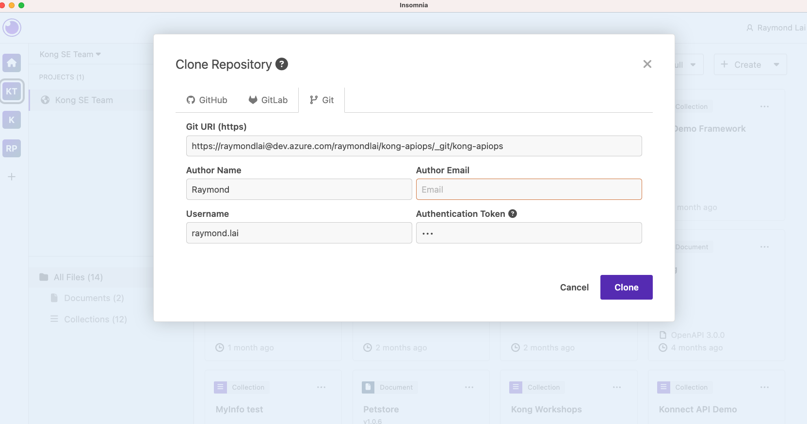

# dino-park-insomnia

Sandbox/experiment repository to try out [Insomnia](https://insomnia.rest)'s Git Sync features. This Insomnia 

## Prerequisites

- [DecK](https://github.com/Kong/deck) (for Kong Configuration management)
- [Insomnia](https://github.com/Kong/insomnia/releases) (use version `2022.3.0-beta.4` and up)
- Kong Gateway installed

## Run

- Import this repository on Insomnia via Git (link to repo is: `https://github.com/raylaijh/apiops-demo-azure.git`)

- If you make changes to the Spec, you can re-run on Insomnia the Declarative config generation (see image bellow), and edit the contents of [kong.json](kong.json) file with the output. Don't forget to re-apply it to your Kong gateway instance by running `deck sync -s kong.json`.

## Other

